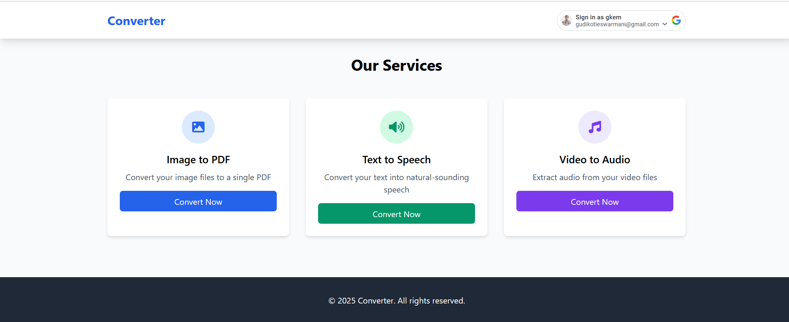
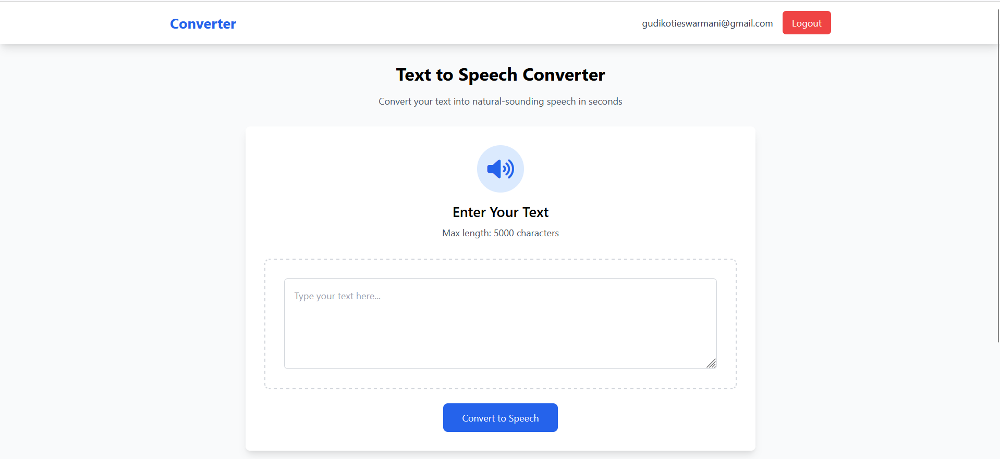
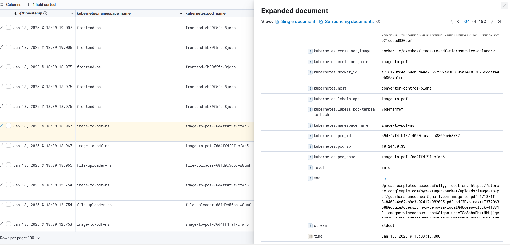
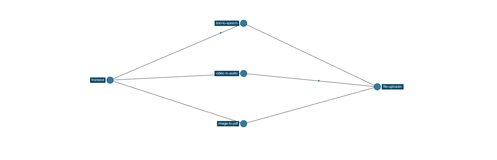

## Microservices Converter Website Demo

### Video

[Watch the demo video](https://drive.google.com/file/d/1pBQbMZa-x9A2mC3LAl75IHsFTSXoFV8c/view)


### Images


*Home Page*


*Text-to-Speech Page*


*Video-to-Audio Page*


*Image-to-PDF Page*


*Download Page*


*Profile Page*


### Observability Snapshots

#### Logs


*Logs Overview*


*Detailed Log Field*

#### Traces


*Traces Overview*


*Trace Flow Between Microservices*


*Trace Spans*


*Istio Traffic Graph*


## gRPC Explanation

gRPC is a high-performance, open-source universal RPC framework initially developed by Google. It uses HTTP/2 for transport, Protocol Buffers as the interface description language, and provides features such as authentication, load balancing, and more.

### How gRPC is Used in This Project

Each microservice in this project exposes a gRPC API for performing its specific conversion task. The gRPC services are defined using Protocol Buffers (proto files), which provide a language-agnostic way to define the service interfaces and message types.

### Example: Video-to-Audio Service

The `Video-to-Audio` service exposes a gRPC endpoint for converting video files to audio. The service definition in the proto file might look like this:

```proto
syntax = "proto3";

package converter;

service VideoToAudioConverterService {
  rpc Convert(stream VideoChunk) returns (ConvertVideoToAudioResponse);
}

message VideoChunk {
  bytes chunk = 1;
}

message ConvertVideoToAudioResponse {
  string url = 1;
}
```

### Making a gRPC Request

To make a gRPC request to the `Video-to-Audio` service, you would use a gRPC client in your preferred programming language. Here is an example in Go:

```go
package main

import (
  "context"
  "log"
  "os"
  "time"

  pb "converter/video-to-audio/genproto"
  "google.golang.org/grpc"
)

func main() {
  conn, err := grpc.Dial("localhost:8082", grpc.WithInsecure())
  if err != nil {
    log.Fatalf("did not connect: %v", err)
  }
  defer conn.Close()

  client := pb.NewVideoToAudioConverterServiceClient(conn)

  stream, err := client.Convert(context.Background())
  if err != nil {
    log.Fatalf("could not convert: %v", err)
  }

  // Read video file and send chunks
  file, err := os.Open("video.mp4")
  if err != nil {
    log.Fatalf("could not open file: %v", err)
  }
  defer file.Close()

  buffer := make([]byte, 64*1024)
  for {
    n, err := file.Read(buffer)
    if err == io.EOF {
      break
    }
    if err != nil {
      log.Fatalf("could not read file: %v", err)
    }

    if err := stream.Send(&pb.VideoChunk{Chunk: buffer[:n]}); err != nil {
      log.Fatalf("could not send chunk: %v", err)
    }
  }

  response, err := stream.CloseAndRecv()
  if err != nil {
    log.Fatalf("could not receive response: %v", err)
  }

  log.Printf("Conversion completed, file URL: %s", response.GetUrl())
}
```