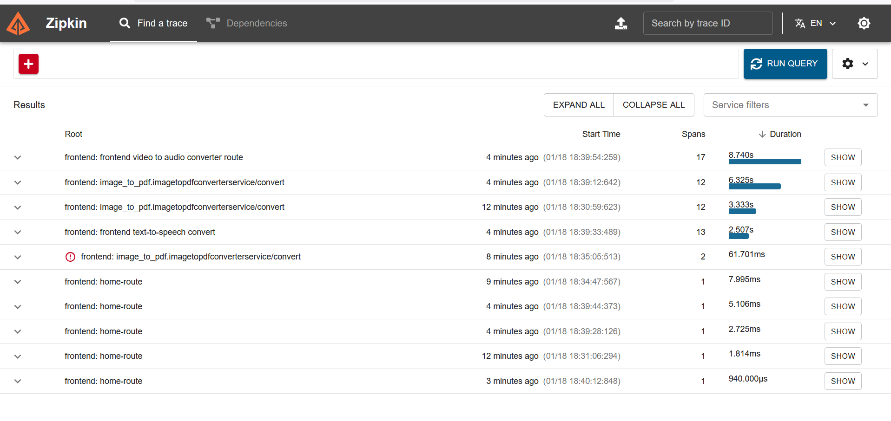

# Microservices Converter Demo

### **Note:-** ⚠️ 
**Google Sign-In can only be displayed on HTTPS domains, not HTTP. For testing and development purposes, we can use it on localhost. Therefore, to use this feature, access the service on localhost to make it work.**

## Overview

This project demonstrates a microservices architecture implemented in Go (Golang). The system consists of several services that perform various media conversion tasks, such as converting text to speech, video to audio, and images to PDFs. Each service is designed to be independent, scalable, and easy to maintain.

Our website provides a user-friendly interface for performing media conversions. Users can sign in using Google and access converter pages like text-to-speech, video-to-audio, and image-to-pdf. The frontend service, built with the Gin framework, renders HTML templates and connects to backend gRPC services to handle the conversion tasks. The website ensures a seamless experience by integrating various microservices to perform specific conversion functions efficiently and also sign in using google to ease authentication like login and logout.

## Services

| Service Name   | Purpose                                                                 | Stack Used                                                                 | Port |
|----------------|-------------------------------------------------------------------------|----------------------------------------------------------------------------|------|
| Frontend       | Provides a user interface for interacting with the various conversion services. | Gin, Logrus, gRPC, PostgreSQL, OpenTelemetry                               | 8080 |
| File Uploader  | A gRPC service that uploads received files via chunks to Google Cloud Storage and generates signed URLs. | gRPC, Logrus, Google Cloud Storage, OpenTelemetry                          | 8084 |
| Image-to-PDF   | A gRPC service that converts image chunks to PDF and sends the PDF chunks to the File Uploader for a signed URL. | gRPC, Logrus, OpenTelemetry, github.com/signintech/gopdf                   | 8083 |
| Video-to-Audio | A gRPC service that converts video chunks to audio and sends the audio chunks to the File Uploader for a signed URL. | gRPC, Logrus, OpenTelemetry, FFmpeg, github.com/u2takey/ffmpeg-go          | 8082 |
| Text-to-Speech | A gRPC service that converts text to speech and sends the audio chunks to the File Uploader for a signed URL. | gRPC, Logrus, OpenTelemetry, github.com/Duckduckgot/gtts                   | 8081 |
| Postgres | Database to store the generated signed URLs | PostgreSQL | 5432 |
| OpenTelemetry Collector | Otel Collector to collect traces from applications via endpoints, process them, and export them to Zipkin for visualization of traces | OpenTelemetry | **HTTP**: 4318 **gRPC**: 4317 **Zipkin**: 9411 |
| EFK Stack | Logging stack: **Fluentd** for forwarding logs to storage, **Elasticsearch** for storing logs in the form of indices for faster retrieval, and **Kibana** for visualizing logs stored in Elasticsearch | Elasticsearch, Fluentd, Kibana | Kibana: 5601, Elasticsearch: 9200 |

## Project Structure

```
converter-gcp/
├── helm-chart/
├── k8s-templates/
├── protos/
├── src/
│   ├── frontend/
│   ├── text-to-speech/
│   ├── video-to-audio/
│   ├── image-to-pdf/
│   └── file-uploader/
├── values/
├── assets/
├── docker-compose.yaml
└── README.md
```

## Website Demo

### Images


*Home Page*


*Text-to-Speech Page*


*Video-to-Audio Page*


*Image-to-PDF Page*


*Download Page*


*Profile Page*

### Video

[Watch the demo video](https://drive.google.com/file/d/1pBQbMZa-x9A2mC3LAl75IHsFTSXoFV8c/view)

### Observability Snapshots

#### Logs


*Logs Overview*


*Detailed Log Field*

#### Traces


*Traces Overview*


*Trace Flow Between Microservices*


*Trace Spans*


## gRPC Explanation

gRPC is a high-performance, open-source universal RPC framework initially developed by Google. It uses HTTP/2 for transport, Protocol Buffers as the interface description language, and provides features such as authentication, load balancing, and more.

### How gRPC is Used in This Project

Each microservice in this project exposes a gRPC API for performing its specific conversion task. The gRPC services are defined using Protocol Buffers (proto files), which provide a language-agnostic way to define the service interfaces and message types.

### Example: Video-to-Audio Service

The `Video-to-Audio` service exposes a gRPC endpoint for converting video files to audio. The service definition in the proto file might look like this:

```proto
syntax = "proto3";

package converter;

service VideoToAudioConverterService {
  rpc Convert(stream VideoChunk) returns (ConvertVideoToAudioResponse);
}

message VideoChunk {
  bytes chunk = 1;
}

message ConvertVideoToAudioResponse {
  string url = 1;
}
```

### Making a gRPC Request

To make a gRPC request to the `Video-to-Audio` service, you would use a gRPC client in your preferred programming language. Here is an example in Go:

```go
package main

import (
  "context"
  "log"
  "os"
  "time"

  pb "converter/video-to-audio/genproto"
  "google.golang.org/grpc"
)

func main() {
  conn, err := grpc.Dial("localhost:8082", grpc.WithInsecure())
  if err != nil {
    log.Fatalf("did not connect: %v", err)
  }
  defer conn.Close()

  client := pb.NewVideoToAudioConverterServiceClient(conn)

  stream, err := client.Convert(context.Background())
  if err != nil {
    log.Fatalf("could not convert: %v", err)
  }

  // Read video file and send chunks
  file, err := os.Open("video.mp4")
  if err != nil {
    log.Fatalf("could not open file: %v", err)
  }
  defer file.Close()

  buffer := make([]byte, 64*1024)
  for {
    n, err := file.Read(buffer)
    if err == io.EOF {
      break
    }
    if err != nil {
      log.Fatalf("could not read file: %v", err)
    }

    if err := stream.Send(&pb.VideoChunk{Chunk: buffer[:n]}); err != nil {
      log.Fatalf("could not send chunk: %v", err)
    }
  }

  response, err := stream.CloseAndRecv()
  if err != nil {
    log.Fatalf("could not receive response: %v", err)
  }

  log.Printf("Conversion completed, file URL: %s", response.GetUrl())
}
```

## Setup and Installation

### Prerequisites

- Docker
- Docker Compose
- Kubernetes (for K8s deployment)
- Helm (for K8s deployment)
- Google Cloud Service Account Key (JSON file)
- Google Cloud Platform (GCP) account

### Setting up Prerequisites 
##### If you are deploying through **Docker** make sure you have Docker installed on your machine. If you are deploying onto Kubernetes, make sure you have kubectl and Helm installed on your machine and also have a Kubernetes cluster (e.g., Kind, Minikube, Managed Kubernetes Clusters).
1. **Get into Google Cloud Console**:
   - Navigate to the [Google Cloud Console](https://console.cloud.google.com/).

2. **Create OAuth Token**:
   - Go to the **Credentials** page under **APIs & Services**.
   - Create an OAuth token of type **Web Application**.
   - Add the following URLs under **Authorized JavaScript origins**:
     ```
     http://localhost
     http://localhost:8080
     ```
   - Add the following URL under **Authorized redirect URIs**:
     ```
     http://localhost:8080/user/google/auth/callback
     ```
   - Make a note of the **Google Client ID** and **Google Client Secret** for use in further sections.
    
    *Sample Screenshot of configuration*
3. **Create GCP Bucket and Service Account Key**:
   - Create a GCP bucket for storing files:
     ```sh
     gsutil mb gs://your-bucket-name
     ```
   - Create a service account key with **Storage Admin** permissions:
     ```sh
     gcloud iam service-accounts create your-service-account --display-name "Service Account for Storage Admin"
     gcloud projects add-iam-policy-binding your-project-id --member "serviceAccount:your-service-account@your-project-id.iam.gserviceaccount.com" --role "roles/storage.admin"
     gcloud iam service-accounts keys create key.json --iam-account your-service-account@your-project-id.iam.gserviceaccount.com
     ```
   - Download the service account key JSON file and place it in the project root directory.

### Docker Deployment 

1. **Clone the repository**:
    ```sh
    git clone https://github.com/Gkemhcs/microservices-converter-golang-grpc.git
    cd microservices-converter-golang-grpc
    ```

2. **Set up environment variables**:
    Ensure you have a `key.json` file for Google Cloud credentials and place it in the project root directory.

3. **Replace placeholders in Docker Compose file**:
    - Open the `docker-compose.yaml` file.
    - Replace `GOOGLE_CLIENT_ID_CREDS` with your Google Client ID.
    - Replace `GOOGLE_CLIENT_SECRET_CREDS` with your Google Client Secret.
    - Replace `GCP_SERVICE_ACCOUNT_NAME` with your GCP Service Account.
    - Replace `GCS_BUCKET` with your GCP Bucket name.

4. **Build and run the services**:
    ```sh
    docker-compose up --build
    ```

5. **Service URLs and Ports**:
    - Frontend: `http://localhost:8080`
    - Text-to-Speech: `http://localhost:8081`
    - Video-to-Audio: `http://localhost:8082`
    - Image-to-PDF: `http://localhost:8083`
    - File Uploader: `http://localhost:8084`

### Kubernetes Deployment

1. **Clone the repository**:
    ```sh
    git clone https://github.com/yourusername/converter-gcp.git
    cd converter-gcp
    ```

2. **Set up environment variables**:
    Ensure you have a `key.json` file downloaded earlier for Google Cloud credentials and place it in the project root directory.

3. **Replace placeholders in Kubernetes values files**:
    - Open the `values/frontend.yaml` file.
    - Replace `GOOGLE_CLIENT_ID_CREDS` with your Google Client ID.
    - Replace `GOOGLE_CLIENT_SECRET_CREDS` with your Google Client Secret.
    - Open the `values/file-uploader.yaml` file.
    - Replace `GCP_SERVICE_ACCOUNT_NAME` with your GCP Service Account.
    - Replace `GCS_BUCKET` with your GCP Bucket name.

4. **Install dependencies**:
    - Deploy PostgreSQL and Redis:
      ```sh
      kubectl apply -f k8s-templates/databases-deployment.yaml
      ```
    - Before deploying OpenTelemetry operator manifests, first deploy the Cert-Manager and OpenTelemetry Operators:
     ```sh
      # install cert-manager
      helm repo add jetstack https://charts.jetstack.io
      helm repo update
      helm install \
        --create-namespace \
        --namespace cert-manager \
        --set installCRDs=true \
        --set global.leaderElection.namespace=cert-manager \
        --set extraArgs={--issuer-ambient-credentials=true} \
        cert-manager jetstack/cert-manager
      # install opentelemetry operator
      kubectl apply -f https://github.com/open-telemetry/opentelemetry-operator/releases/latest/download/opentelemetry-operator.yaml
     ``` 
    - Deploy OpenTelemetry Collector and Zipkin:
      ```sh
      kubectl apply -f k8s-templates/observability.yaml
      ```

5. **Install the EFK stack**:
    - Deploy Elasticsearch:
      ```sh
      helm repo add elastic https://helm.elastic.co
      helm install elasticsearch \
      --set replicas=1 \
      --set persistence.labels.enabled=true elastic/elasticsearch -n logging \
      --create-namespace
      ```
    - Retrieve Elasticsearch Username & Password:
      ```sh
        # for username
        kubectl get secrets --namespace=logging elasticsearch-master-credentials -ojsonpath='{.data.username}' | base64 -d
        # for password
        kubectl get secrets --namespace=logging elasticsearch-master-credentials -ojsonpath='{.data.password}' | base64 -d
      ```
    
    - Deploy Kibana:
      ```sh
        helm install kibana --set service.type=LoadBalancer elastic/kibana -n logging
      ```

    - Deploy Fluentd: 👉 **Note**: Please update the `HTTP_Passwd` field in the `fluentbit-values.yml` file with the password retrieved earlier in step 6: (i.e., NJyO47UqeYBsoaEU)
      ```sh
      helm repo add fluent https://fluent.github.io/helm-charts
      helm install fluent-bit fluent/fluent-bit -f values/fluentbit-values.yaml -n logging
      ```

6. **Deploy the services using Helm**:
    ```sh
    helm install frontend ./helm-chart/ -f values/frontend.yaml --namespace frontend-ns --create-namespace
    helm install text-to-speech ./helm-chart/ -f values/text-to-speech.yaml --namespace text-to-speech-ns --create-namespace
    helm install video-to-audio ./helm-chart/ -f values/video-to-audio.yaml --namespace video-to-audio-ns --create-namespace
    helm install image-to-pdf ./helm-chart/ -f values/image-to-pdf.yaml --namespace image-to-pdf-ns --create-namespace
    helm install file-uploader ./helm-chart/ -f values/file-uploader.yaml --namespace file-uploader-ns --create-namespace --set-file keyJson=./key.json
    ```

7. **Port Forward services to access them locally**:
 ```sh
 # Website Frontend 
 kubectl port-forward svc/frontend -n frontend-ns 8080:8080
 # Logs Dashboard 
 kubectl port-forward svc/kibana-kibana -n logging 5601:5601
 # Traces Dashboard
 kubectl port-forward svc/zipkin -n observability-ns 9411:9411
 ``` 

8. **Access the services**:
    - Frontend: `http://localhost:8080`
    - Text-to-Speech: `http://localhost:8081`
    - Video-to-Audio: `http://localhost:8082`
    - Image-to-PDF: `http://localhost:8083`
    - File Uploader: `http://localhost:8084`
    - Kibana: `http://localhost:5601`
    - Zipkin: `http://localhost:9411`

## Usage

1. **Frontend**:
    - Open the frontend URL in your browser: **http://localhost:8080**
    - Use the provided interface to upload files and perform conversions.

2. **API Endpoints**:
    - Each service exposes gRPC endpoints for performing conversions. Refer to the respective service's proto files for detailed API documentation.

## Contact Information

For support or questions, or if you face any issues, please contact [gudikotieswarmani@gmail.com](mailto:gudikotieswarmani@gmail.com).

## Contributing

We welcome contributions to improve the project. Please fork the repository and submit pull requests.


